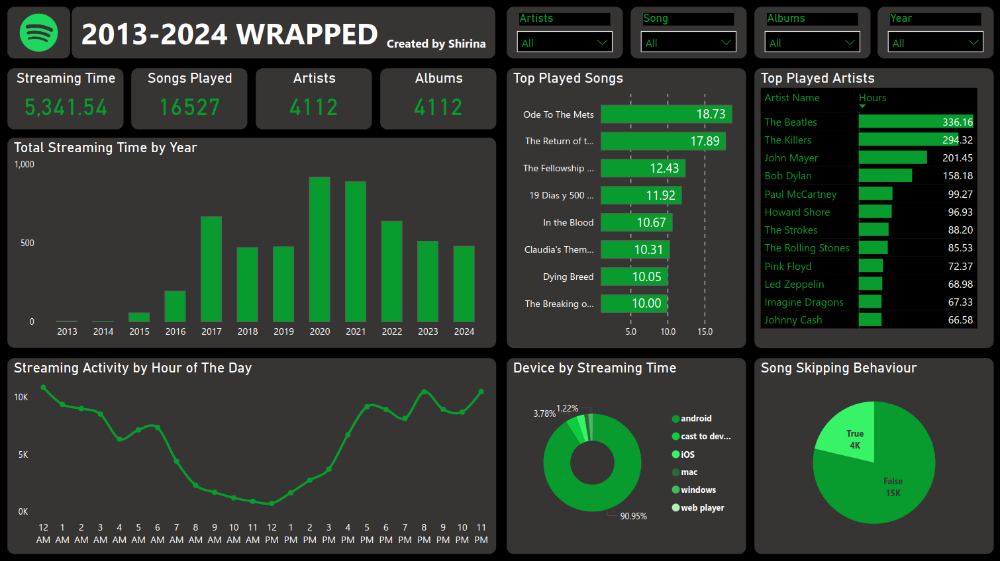

# Spotify Wrapped - Interactive Analytics Dashboard
**Spotify Wrapped** is an engaging and interactive dashboard that visualizes Spotify listening habits over the past years.  It is divided into multiple sections with key performance indicators (KPIs) and interactive charts that explore my listening patterns in depth.

## Spotify Insights:

### Key Performance Indicators (KPIs):
**Total Stream Hours:** Displays the total number of hours spent streaming music.
**Total Songs Played:** Shows the number of songs played during the year.
**Total Artists & Albums:** Highlights the number of unique artists and albums listened to.

These KPIs are displayed in a sleek, card-based format, making it easy to understand overall music consumption at a glance.

### Visual Insights:

**Streaming Activity by Hour (Line Chart):** This line chart shows how listening activity varies throughout the day, providing a clear view of when I tend to listen to music the most. It tracks total songs played per hour, allowing me to identify peak listening times.

**Top Played Artists (Bar Chart):** A bar chart visualizes top 10 most-played artists, showing how many hours I spent listening to each artist.

**Platform Usage (Pie Chart):** This pie chart provides insights into which platforms (mobile, desktop, web) used to listen to Spotify. It visually breaks down the percentage of time spent on each platform, offering a clear look at the device preferences.

**Top Played Tracks (Bar Chart):** Another bar chart highlights top 10 most-played tracks, showing how many hours spent listening to each. Similar to the artist chart, hovering over the bars reveals more details like track name and play time.

**Streaming Activity by Day of the Week (Line Chart):** This line chart breaks down the listening activity across the days of the week. It shows when I’m most likely to listen to music on specific days, offering a deeper dive into my music preferences by day.

**Skipped Songs Rate (Pie Chart):** This pie chart shows the rate at which I skip songs, broken down into skipped vs. not skipped, giving insights into how often I skip songs during my listening sessions.

**End Reasons for Streams (Bar Chart):** This bar chart visualizes the reasons for ending a music stream (e.g., song end, manually skipped, or playlist end). It helps analyze why certain tracks or playlists are cut short.

**Top Played Albums (Bar Chart):** Displays the albums I’ve played the most, broken down by total listening hours. The bar chart allows users to explore the most impactful albums in my library.

By combining these interactive charts and insights, the dashboard allows users to fully explore my music habits and preferences in a dynamic, engaging way. Whether you're interested in top artists, skipped songs, or platform usage, this project provides a comprehensive look at my Spotify listening activity.

**Note:** There's another version of this project built with Power BI. Feel free to check it out [here on Maven Analytics](https://mavenanalytics.io/project/26043).

Also, if you would like to view all the steps in details, check out this [Medium Article](https://medium.com/@msk-shirina)

Details about the data used in this project can be found [here](https://mavenanalytics.io/challenges/maven-music-challenge/e161353d-9967-4297-869c-505de168e610).
